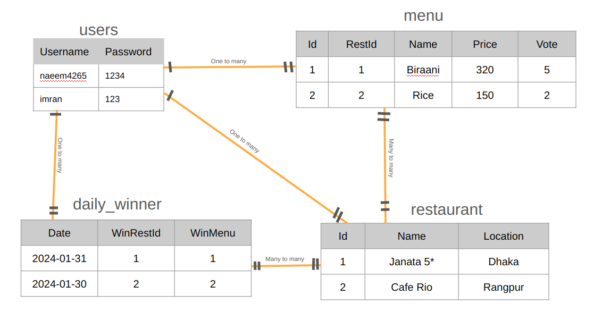

# Catering Voting Management App
## Overview
This project is a Catering Voting App developed for BD-23 PLC, one of the largest and fast-growing companies in the country. The app addresses the challenge of providing diverse catering options to employees by allowing them to vote for their favorite restaurant menus. The menu with the most votes is chosen for the day.

## Technologies Used

- **Golang:** Our backend is powered by Go, the language known for its speed and efficiency.

- **Chi Router:** Handling web traffic is a breeze with Chi – it's lightweight, fast, and keeps things running smoothly.

- **JWT (JSON Web Tokens):** Security is a top priority; we use JWT for safe and stateless user authentication.

- **MySQL:** All the important data, from restaurant details to voting results, is securely stored in a MySQL database.

- **Docker Compose:** Docker Compose is used to build and run multi-container applications. In this project, both the app and the database are containerized.
- **Git:** Collaboration made easy! Git helps us track changes, collaborate seamlessly, and keep a neat project history.

## Features

### User Authentication:

- **Sign In:**
  Employees can authenticate using their credentials through a secure POST request to `/signin`.

- **Sign Out:**
  Employees can log out with a GET request to `/signout` when their Catering decisions are made.

### Restaurant Management:

- **Create Restaurant:**
  Employees have the ability to add new restaurants by sending a POST request to `/restaurant`.
- **Create Menu:**
  Employees have the ability to add new Menu by sending a POST request to `/menu`.

### Employee Management:

- **Create Employee:**
  The system allows the creation of new employee profiles via a POST request to `/users`.
- **Employee List:**
  The system allows the get the list of employee profiles via a GET request to `/users`.

### Catering Voting: The winner restaurant should not be the winner for 3 consecutive working days.

- **Get Current Day Menu:**
  Employees can view the current day's menu with a GET request to `/menu`.

- **Vote for Restaurant Menu:**
  Employees participate in the voting process by submitting their preferences through a PUT request to `/menu/vote/menuId`.

- **Get Results for Current Day:**
  Check the winning restaurant and menu for the day with a GET request to `/menu/winner`.
  - Ensures variety by avoiding the same restaurant winning for three consecutive working days.
- **Get Results for Previous Day:**
  Check the wined restaurant and menu for the previous day with a GET request to `/menu/result`.
### Logout:

- **Logout:**
  Securely log out and invalidate authentication tokens with a POST request to `/logout`.

## Entity-Relationship (ER) diagram



### Overview

This ER diagram illustrates the database schema for the Catering Voting App, providing a visual representation of the relationships between entities.

### Entity Relationships

- **Between:** User Table and Menu, Restaurant and Daily Winner talbles
  - **From:** User Table
  - **To:** Menu Table, Restaurant Table, Daily Winner Table
  - **Description:** Each user in the User Table can be associated with multiple records in the Menu, Restaurant, and Daily Winner tables, forming a one-to-many relationship.

- **Between:** Menu Table and Restaurant Table
  - **Description:** Each menu in the Menu Table can be associated with multiple restaurants, and each restaurant in the Restaurant Table can have multiple menus, forming a many-to-many relationship.

- **Between:** Daily Winner Table and Restaurant Table
  - **Description:** Each daily winner in the Daily Winner Table can be associated with multiple restaurants, and each restaurant in the Restaurant Table can have multiple daily winners, forming a many-to-many relationship.

## Usage

These entity relationships guide the database interactions within the Catering Voting App. Understanding these relationships is crucial for designing queries, maintaining data integrity, and developing features that involve multiple entities.


## Getting Started
#### Run Docker Compose File
1. **Clone the repository:**
   ```bash
   git clone git@github.com:naeem4265/Catering-Management.git
   cd Catering-Management
   ```
2. **Clear 3306 Port usage:**
    ```
    sudo lsof -i :3306
    sudo kill <PID>
    ```
3. **Start application by running docker compose up:**
   ```bash
   docker compose down
   docker compose up --build
   ```
4. **Open your Postman and navigate to [http://localhost:8080/](http://localhost:8080/) with appropiate json body:**
    - Create User: POST [http://localhost:8080/users](http://localhost:8080/users)
      ```
      {
          "username":"naeem4265",
          "password":"1234"
      }
      ```
    - Get Users: GET [http://localhost:8080/users](http://localhost:8080/users)
    - Signin User: POST [http://localhost:8080/signin](http://localhost:8080/signin)
      ```
      {
          "username":"naeem4265",
          "password":"1234"
      }
      ```
    - Add restaurant: POST [http://localhost:8080/restaurant](http://localhost:8080/restaurant)
      ```
      {
          "restaurantName":"Janata",
          "restaurantLocation": "Gazipur"
      }
      ```
    - Add menu: POST [http://localhost:8080/menu](http://localhost:8080/menu)
      ```
      {
          "restaurantId":1,
          "menuName":"Biryani",
          "menuPrice":500
      }
      ```
    - Get menu: GET [http://localhost:8080/menu](http://localhost:8080/menu)
    - Give Vode for menu id: PUT [http://localhost:8080/menu/vote/1](http://localhost:8080/menu/vote/1)
    - Get today's menu: GET [http://localhost:8080/menu/winner](http://localhost:8080/menu/winner)
    - Get previous result: GET [http://localhost:8080/menu/result](http://localhost:8080/menu/result)
    - Confirm today's menu: POST [http://localhost:8080/menu/confirm](http://localhost:8080/menu/confirm)
    - Signout User: GET [http://localhost:8080/signout](http://localhost:8080/signout)

#### Run Manually
1. **Clone the repository:**
   ```bash
   git clone git@github.com:naeem4265/Catering-Management.git
   cd Catering-Management
   ```

2. **Install dependencies:**
   ```bash
   go mod tidy && go mod vendor
   ```

3. **Configure the database:**
   - Create a MySQL database with the following configurations:
     - Username: root
     - Password: "1234"
     - Database name: catering_management
     - Port: 3306
     - Connection: tcp
   - Execute the MySQL scripts in the `mysql/` folder to create the necessary tables and seed data.

4. **Build and run the application:**
   ```bash
   go run *.go
   ```

6. **Access the API documentation:**
   - Open your Postman and navigate to [http://localhost:8080](http://localhost:8080) with appropiate json body.

## Conclusion

The Catering Management App simplifies catering decisions at BD-23, using Golang, Chi Router, JWT, MySQL, and Git. Key features include secure user authentication, restaurant and menu management, employee profiles, and efficient catering voting. The app ensures variety by preventing consecutive wins, providing a seamless and enjoyable experience.

## Note

**NB: The project is under development.**

Please be aware that the Catering Management App is currently in the development phase. Features and functionality may be subject to change over time.
